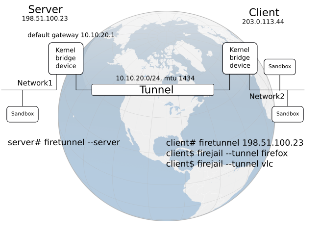

# Firetunnel

Firetunnel is a simple program for connecting multiple Firejail sandboxes
on a virtualized Ethernet network. Applications include
virtual private networks (VPN), overlay networks, peer-to-peer applications.

The tunnel encapsulates Ethernet frames in UDP packets. Each packet is authenticated
independently with BLAKE2 cryptographic hash function (https://blake2.net/).
The keys are derived from a common secret file installed on both client and server.

The traffic is not encrypted. On Linux, several excellent programs are already
providing military-grade encryption. Among them OpenVPN, stunnel, Wireguard.
If this is what you are looking for, Firetunnel should not be your choice.
However, we do some light-weight bit scrambling.
Our goal is to avoid the data collection and the blacklist-based traffic shaping
going on some ISP networks.

Setup and configuration are extremely easy.
For every single aspect of the tunnel we provide sensible defaults.
Everything is integrated seamlessly with Firejail.


## Features

* Ethernet transport over UDP.

* Strong built-in authentication system based on Blake2 hash function.

* Traffic scrambling, plugin support (C programable).

* Layer 2/3/4 header compression based on RFC 2507.

* In-tunnel DNS support and speed test.

* Firewall friendly.

* Network address translation in the firewall on the server side.

* Automatic network configuration for client and sandboxes based on RFC 5227 and our tunnel configuration protocol.

* Runs on any Linux system with a kernel 3.5 or newer.

* Minimal attack surface, seccomp support.

* Fast and easy to use.

* License: GPLv2


## Software install

Compile-time dependencies: libseccomp (https://github.com/seccomp/libseccomp)

Run-time dependencies: dnsutils (https://www.isc.org)

On Debian/Ubuntu run "sudo apt-get install build-essential git libseccomp-dev dnsutils"

Compile and install:
`````
$ git clone https://github.com/netblue30/firetunnel.git
$ cd firetunnel
$ ./configure && make && sudo make install-strip
`````

## Usage



You need two computers, one for the client and one for the server.
The time needs to be synchronized between them in a 10 second window.
This should not be a problem, by default most Linux distributions are running the NTP daemon.
Start by setting a common secret file in /etc/firetunnel/firetunnel.secret:
`````
# cp summer.jpg /etc/firetunnel/firetunnel.secret
`````

Any file will do as long as the same file is installed on both computers. You also need to configure the access permissions:
`````
# chmod 600 /etc/firetunnel/firetunnel.secret
`````
SSH into your remote computer and start the server:
`````
# firetunnel --server
`````
In a different terminal on your home computer start the client:
`````
# firetunnel 198.51.100.23
`````
198.51.100.23 is in this example the remote server IP address.
In a few seconds you will see the client connecting and receiving the tunnel configuration:
`````
2018-08-01 21:09:01 198.51.100.23:1119 connected
2018-08-01 21:09:01 Tunnel: 10.10.20.0/24, default gw 10.10.20.1, mtu 1426
2018-08-01 21:09:01 Tunnel: DNS 1.1.1.1, 208.67.222.222, 9.9.9.9
`````
All the commands above are entered as root. Time to switch back to your regular user
and start a few sandboxes on your client computer:
`````
$ firejail --tunnel firefox &
$ firejail --tunnel transmission-qt &
`````
Multiple clients can be connected to the same server machine, this is an example:


## Project status: version 0.8, beta testing


